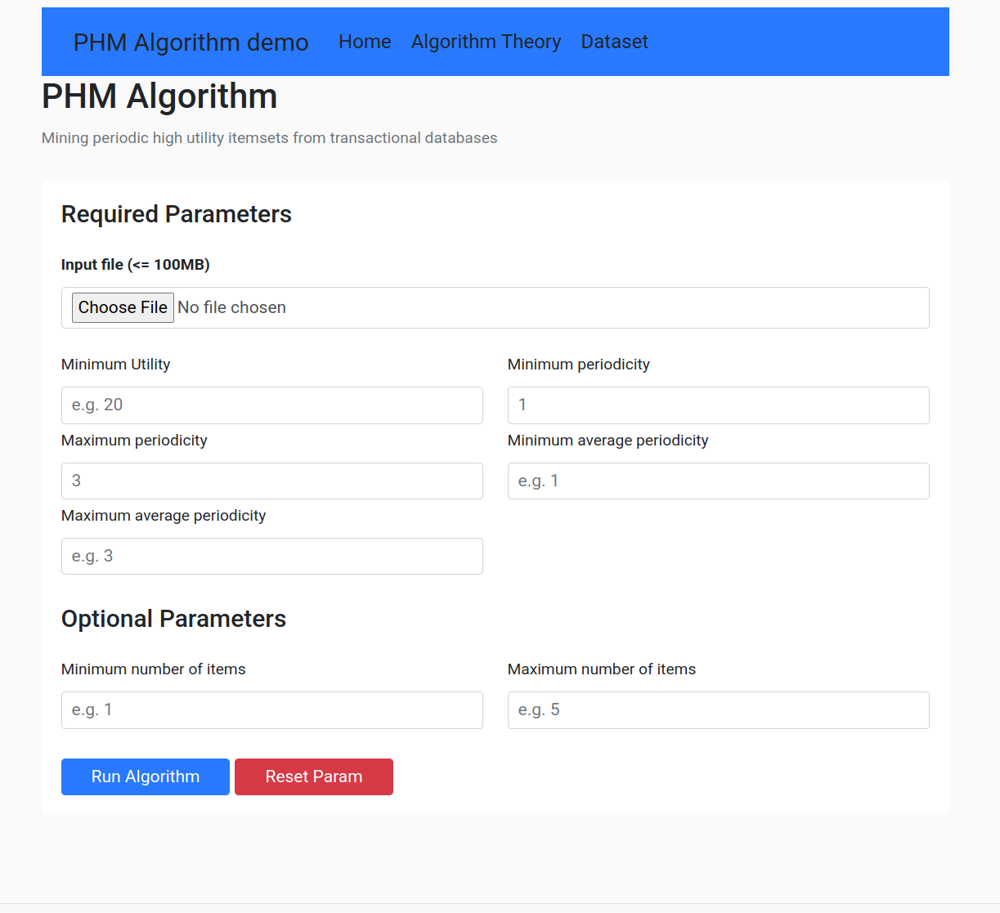
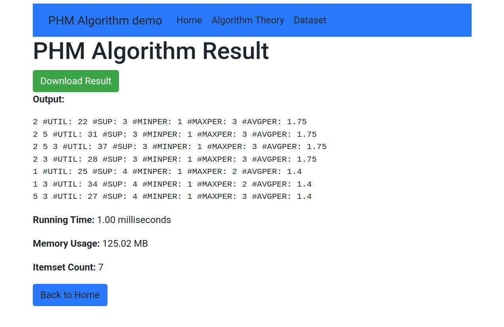

# How to run Demo PHM Algorithm Web App

## Requirement 
- Java >= 17
- Internet to download dependency.

## Guide to run Spring Boot App
### Step 1: Download `smpf.jar` library from SPMF website.
- [spmf.jar download page](https://www.philippe-fournier-viger.com/spmf/index.php?link=download.php)

### Step 2: Install `smpf.jar` as local repository
change directory to root folder of Spring Boot App (directory have `pom.xml`). Then execute command using maven wrapper.

```bash
./mvnw install:install-file -Dfile=/home/nhan/Downloads/test_files/spmf.jar -DgroupId=ca.pfv.spmf -DartifactId=spmf -Dversion=1.0 -Dpackaging=jar
```
### Step 3:
Clean and build spring boot app
```bash
./mvnw clean package
```

### Step 4:
Open Browser and access url [http://localhost:8080](http://localhost:8080)

### Step 5:
- Fill the form and click run algorithm then wait for result.
- You can download result then using for analysis or visualize.

## Screenshot

<dl>
<dd>


- Home page


</dd>
<dd>

Result page


</dd>
</dl>